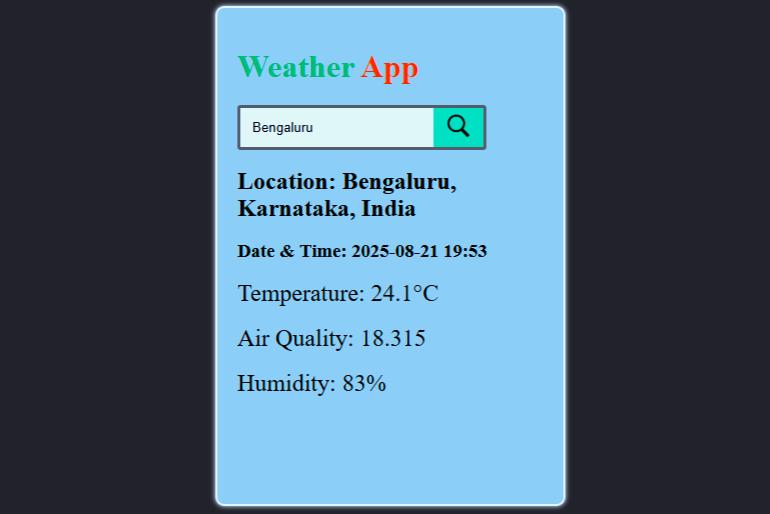

# Weather-application
The Weather Application is a responsive web app built with HTML, CSS, and JavaScript that fetches real-time weather data using the WeatherAPI. It allows users to search for any city and instantly view weather details with a simple and clean interface.
